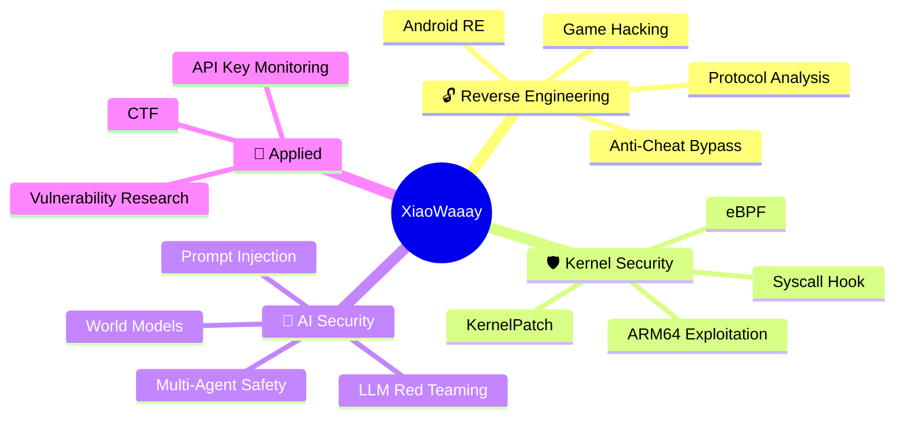

<!-- 动态打字机效果 -->

<!-- 头像 + Banner -->

<!-- About Me -->
##  About Me

<table>
<tr>
<td width="50%" valign="top">

### 🧑‍💻 Profile

- 🔭 **昵称：** xiaowaaa
- 🎓 **学校：** 电子科技大学 (UESTC) 研究生在读
- 🔐 **方向：** 安全研究 & AI Safety
- 💬 **座右铭：** *Break it to understand it, secure it to protect it.*

</td>
<td width="50%" valign="top">

### 🔬 Current Research

- 🤖 **多智能体安全** — Multi-Agent System Safety
- 🌍 **世界模型** — World Models & Reasoning
- 🛡️ **大模型安全** — LLM Red Teaming & Defense
- 🎮 **游戏逆向** — Game Hacking & Kernel Anti-Cheat

</td>
</tr>
</table>

<!-- GitHub Streak -->

---

## 🛠️ Tech Stack & Arsenal

### 🔓 Reverse Engineering & Security

### 🎮 Game Hacking & Kernel

### 🤖 AI & LLM

### 💻 Languages & Tools

---

## 🔬 Research Interests

---

## 📊 GitHub Stats

  
  

 

<!-- Activity Graph -->

  

<!-- Snake Animation -->

  <picture>
    <source media="(prefers-color-scheme: dark)" srcset="https://raw.githubusercontent.com/XiaoWaaay/XiaoWaaay/output/github-snake-dark.svg" />
    <source media="(prefers-color-scheme: light)" srcset="https://raw.githubusercontent.com/XiaoWaaay/XiaoWaaay/output/github-snake.svg" />
    
  </picture>

---

## 🏆 GitHub Trophies

  

---

## 📫 Contact Me

---

### 💡 "The quieter you become, the more you are able to hear."

 

 

<!-- 动态波浪底部 -->

